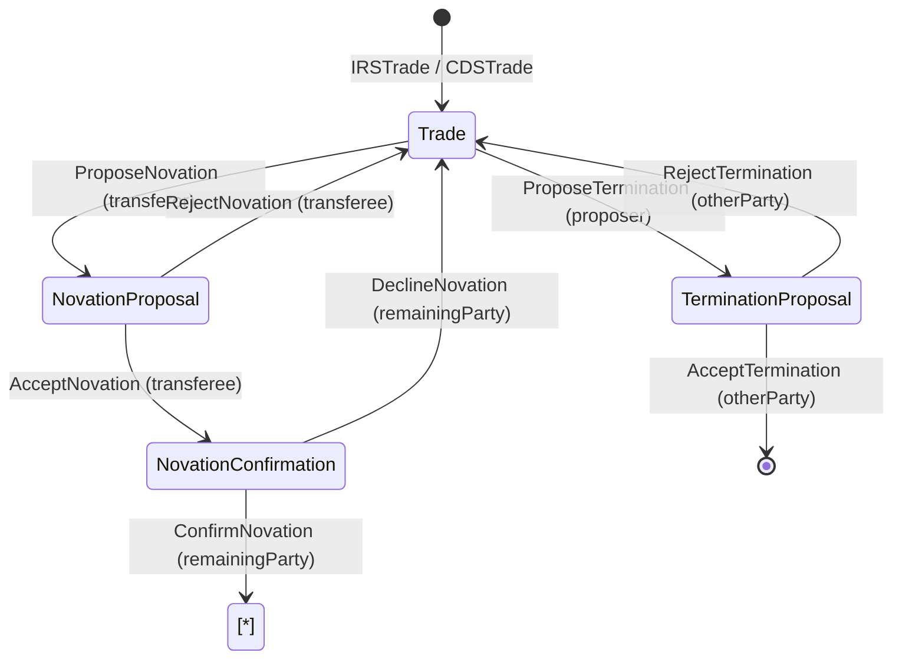
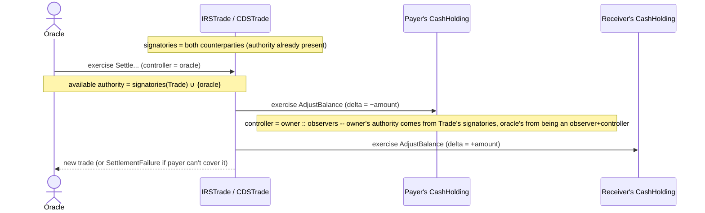
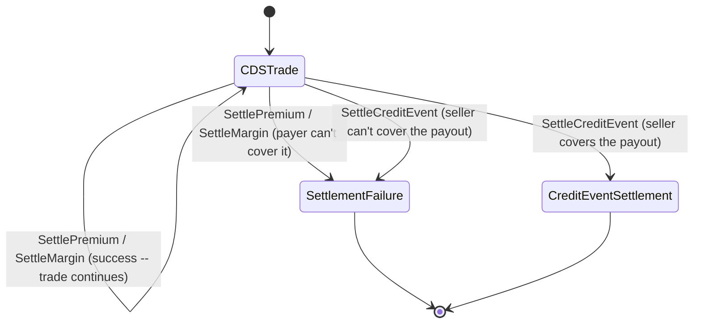

# Canton / DAML Architecture Notes

Reference notes for whoever is building on this project, so contract and
client code stays consistent with how Canton actually works rather than
assumptions carried over from other DLT stacks (Ethereum, Hyperledger
Fabric). Organized into **Common** concepts (apply to both IRS and CDS,
and to Canton generally), then what's specific to **IRS** and **CDS**.

## Common

### DAML authorization vocabulary

- **Signatory** — must consent for a contract to exist; bound by whatever
  the contract lets happen to them afterward.
- **Observer** — can see the contract; no rights over it.
- **Controller** — can exercise a specific choice; must be at least an
  observer, need not be a signatory. This is how delegation works.
- **Choice** — the only way state changes. `consuming` (default) archives
  the contract; `nonconsuming` leaves it live (for repeatable actions like
  periodic settlement or margin calls).
- **Interface** — a named, typed contract shape (a `viewtype` plus a set
  of choices/methods) that a template can *implement*. A contract id can
  be converted between its concrete template type and any interface it
  implements (`toInterfaceContractId`/`fromInterfaceContractId`); a choice
  declared on the interface can be exercised on the interface-typed
  contract id, and its authorization follows the same
  signatories-union-controllers rule as any template choice — see
  "Shared lifecycle via interfaces" below.
- Authorization is **non-transitive**: a signatory only pre-authorizes the
  *direct* consequences of a choice on their contract, not arbitrary
  downstream effects.
- **Propose-accept pattern**: the standard way to get a bilateral contract
  onto the ledger without one party unilaterally binding the other, and —
  more fundamentally — the only way to combine two parties' authority when
  they're on different participant nodes. See "Propose-accept: carrying
  authority across transactions" below.

### Shared lifecycle via interfaces

IRS and CDS are two economically different products, but their novation
and termination mechanics — propose → accept/reject, then (for novation)
confirm/decline by a third party — are *structurally identical*: same
guards, same authority-carrying trick, same shape of "embed the original,
recreate it verbatim on a decline." Rather than writing that logic twice
under name-compatible-but-separate templates, `Lifecycle.daml` hosts it
**once**, as two Daml interfaces (`INovatable`/`ITerminable` and their
proposal/confirmation counterparts), and `IRSTrade`/`CDSTrade` each
implement a handful of small per-product hooks.

This is modeled directly on the Daml SDK's own `daml-intro-13` tutorial
(`IAsset`/`Cash`/`NFT`, bundled with this project's pinned SDK 2.10.4),
which solves the structurally identical problem — a shared
transfer-proposal lifecycle across two heterogeneous asset templates —
the same way: the interface hosts the generic choice bodies; each
template implements small hooks (`setOwner`, `toTransferProposal`, ...)
that touch its own real fields; the interface's choices are called with
`this` as an explicit first argument (`toTransferProposal this newOwner`,
not an implicit method-call syntax).

The proposal/confirmation templates **embed the full underlying trade as
a plain value field** (`orig : IRSTrade`, matching the tutorial's `cash :
Cash`) — not a contract-id reference — so there's no staleness/race risk,
and declining is just `create (trade this)` (recreating that embedded
value verbatim, fresh contract id), no field-by-field reconstruction.



**Why one interface method name can't be reused across two interfaces in
the same module**: `INovationProposal` declares a method `trade :
INovatable`; `ITerminationProposal` needed the analogous "give me back the
embedded original" method but had to name it `terminatingTrade` instead —
Daml interface method names share **one flat namespace per module**, not
one scoped per interface (confirmed by the compiler: reusing `trade` in
both produced "Multiple declarations of `trade`"). Two interfaces can
each declare a `view` field of the same name inside their own `data
V...` record — those are fine, since each lives in its own record type —
but bare interface method names collide module-wide.

**Entering via the interface needs an explicit conversion; the rest is
free.** `ProposeNovation`/`ProposeTermination` are choices declared on
`INovatable`/`ITerminable`, not on `IRSTrade`/`CDSTrade` directly, so
exercising them the first time needs `toInterfaceContractId`:

```haskell
exerciseCmd (toInterfaceContractId @INovatable tradeCid) ProposeNovation with ...
```

(Daml has no instance letting an interface choice be exercised directly
on the *template's own* contract id without this conversion — confirmed
by the compiler: `No instance for (HasToAnyChoice CDSTrade ProposeNovation ...)`
on the first attempt.) Every choice *after* that one chains for free,
because each interface choice's own return type is already
interface-typed (`ContractId INovationProposal`, then `ContractId
INovationConfirmation`, then `ContractId INovatable`) — no repeated
conversions needed mid-flow. The only other place a conversion is needed
is the opposite direction: code that wants the concrete trade's own
fields back (e.g. a test asserting on `trade.fixedRatePayer`) calls
`fromInterfaceContractId @IRSTrade` on the final `ContractId INovatable`
the flow hands back.

### Authority vs. visibility (two separate things)

A lesson this codebase validated concretely, worth stating plainly because
they're easy to conflate:

- **Authority** = who consents to a transaction. When a choice is
  exercised, the resulting subtree is authorized by (the contract's
  signatories) ∪ (the choice's controllers) — and this rule applies
  identically whether the choice is declared on a template or inherited
  from an interface the template implements. Because `IRSTrade` is signed
  by *both* `fixedRatePayer` and `floatingRatePayer`, any choice on it —
  even one controlled by a third party like the oracle, or one inherited
  from `INovatable` — already carries both counterparties' authority.
  That's why the oracle can move *their* cash: exercising `AdjustBalance`
  (controller = the account owner) is authorized without either party
  submitting anything.
- **Visibility** = who can *see* a contract to act on it. Independent of
  authority. The submitting/reading parties must be stakeholders
  (signatory or observer) of any contract the transaction fetches or
  exercises. The oracle has full authority to move the cash but, unless
  it's also a stakeholder of the `CashHolding`, it literally can't see it
  to do so — the exercise fails `CONTRACT_NOT_FOUND` / "not visible to the
  reading parties".

Two ways to grant the needed visibility: (a) the submitter reads-as the
owners (`readAs` claims in the JWT / `submitMulti`), or (b) make the third
party a declared **observer** on the asset. This project uses (b) — the
oracle is an observer on every cash account — because it's explicit in the
data model and works from Navigator (which submits with `actAs` = only the
logged-in party, no `readAs`). The trade-off: the oracle can then see
every counterparty's balance, which for a settlement/calc agent is
realistic.

**The same rule applies to `fetchByKey`/`exerciseByKey`, not just
`fetch`/`exercise` by contract id** — a lesson this codebase hit
concretely when a first draft of `AcceptTrade` tried to validate that
both the proposer's and counterparty's `CashHolding` already existed:

```
Attempt to fetch, lookup or exercise a key associated with a contract
not visible to the committer.
Contract: #0:0 (Cash:CashHolding)
Key: issuer = 'Bank'; owner = 'Alice'; currency = USD
actAs: 'Bob'; readAs:
Stakeholders: 'Alice', 'Bank', 'Oracle'
```

`AcceptTrade` is submitted by `counterparty` (Bob), who is neither a
signatory nor observer of *proposer's* (Alice's) account — only the
oracle is. Authority wasn't the problem (the choice's own controller,
`counterparty`, was correctly authorized); visibility was: a key lookup
still has to resolve against contracts the **submitter** can actually
see, the same constraint as any `fetch`. The fix was to drop that
eager validation — `AcceptTrade` doesn't check either account exists,
same as before this codebase used keys at all — and let a missing
account surface naturally at the first real settlement, which the
oracle submits and can see everything for. See `Cash.daml`'s
`tryMoveCash` and README.md's "What `CashHolding` maps to" for the
key design itself.

**Where the key → contract id mapping actually lives.** There is no
global key index, consistent with "No global ledger" below — each
**participant** maintains its own local one, built incrementally from
the transactions it's been privy to, with entries only for keys of
contracts where a party it hosts is a stakeholder (exactly why Bob's
participant had no entry for `(Bank, Alice, USD)` above). When the
**submitting** participant interprets a `fetchByKey`/`exerciseByKey`,
it resolves the key against its own local index to a concrete contract
id, which becomes part of the transaction; every other informee
participant then independently re-validates that resolution against
*their* own local index during normal confirmation (the same "each
recipient locally validates its own view" step in "Transaction flow"
below) — so a stale local index causes a commit failure/retry, not
silent corruption.

The `maintainer` clause is what makes this resolvable at all in a
system with no global authority: because a maintainer must be a
signatory of any contract with that key, the maintainer's participant
is *structurally guaranteed* to always know that key's current state —
it's the one party the protocol can always ask "is this key currently
live, and pointing to what?" Without a declared maintainer there'd be
no guaranteed authority to ask. Concretely here, `CashAccountKey`'s
`maintainer key.issuer` means **the Bank's participant is the
authority for every `CashAccountKey` it maintains** — in this single-
sandbox demo that's invisible (Bank/Alice/Bob/Oracle are all one
participant), but in a real multi-participant deployment, a settlement
between Alice and Bob would still need the Bank's participant reachable
to resolve each key, exactly the operational dependency you'd expect a
real custodian relationship to have.

### Propose-accept: carrying authority across transactions

A **single Daml transaction is submitted by one participant node**, which
can only supply `actAs` authority for parties *it hosts* (and that the
caller's token covers). A choice with two independent controllers on two
different parties — e.g. an early, rejected draft of this codebase's

```haskell
choice Novate : ContractId IRSTrade
  with outgoingParty : Party; incomingParty : Party; incomingCashCid : ContractId CashHolding
  controller outgoingParty, incomingParty
```

— can therefore only ever be submitted directly when **both** parties are
hosted on the same participant, because only then can one submission
`actAs` both of them at once. `Daml Script`'s `submitMulti [bob, charlie]
[] …` works *only* because the sandbox hosts every party on a single
node — it is a testing convenience, not something a real
cross-organization deployment can do. The moment Bob and Charlie sit on
distinct participants (see "Sync domains / Global Synchronizer" below),
Bob's node cannot `actAs` Charlie, and a direct multi-controller choice
like that becomes unsubmittable — full stop, not just inconvenient.

The fix is to split one logically-joint action into **two or more
sequential single-party transactions**, using a contract as the carrier
that freezes an earlier party's authority so a later transaction can pick
it up. When a later choice is exercised on that contract, the
transaction's available authority = (the contract's **signatories**) ∪
(the choice's **controllers**) — so a party who is merely a *signatory*
of the carrier contract contributes its authority to whatever that
contract's controller-only choices do next, with no further submission
from that party required. Nothing restricts this to two hops either —
chain it again and a third party's consent joins the same way. Three
instances of this pattern in this codebase, all now implemented through
`Lifecycle.daml`'s shared interfaces (see above) rather than duplicated
per product:

- **Trade execution** — `TradeProposal` (signatory = `proposer` alone) /
  `AcceptTrade` (controller = `counterparty`), duplicated per product
  since there's no existing trade to embed yet at proposal time (see
  "Qualified imports" below for why duplication here, specifically, is
  fine). Accepting creates the live trade signed by both parties;
  available authority at that point = `{proposer}` (from the proposal's
  signatory) ∪ `{counterparty}` (the accept choice's controller) = exactly
  the two signatories needed. Neither party ever needed to `actAs` the
  other.

- **Novation — tri-party, chained twice.** Real ISDA novations need three
  consents, not two: the **transferor** (stepping out), the **transferee**
  (stepping in), and the **remaining party** — whose counterparty credit
  risk changes as a result, so they get a genuine say, not just inherited
  authority. That's `ProposeNovation` (a *consuming* interface choice on
  the live trade, `controller transferor`) → `NovationProposal` →
  `AcceptNovation` or `RejectNovation` (`controller transferee`) →
  `NovationConfirmation` → `ConfirmNovation` or `DeclineNovation`
  (`controller remainingParty`). `transferor`/`transferee` are ISDA's own
  Novation Agreement terms for the two roles. Three details make this one
  work correctly:

  1. **Archiving the old trade needs no new authority.** Because
     `ProposeNovation` is exercised *on* the live trade (via its
     `INovatable` interface contract id), whose signatories are already
     both counterparties, the archive is authorized regardless of which
     single party is the choice's controller (see "Authority vs.
     visibility" above) — `transferor` alone is enough to trigger it.
     This also fixes `remainingParty` for the whole flow: it's computed
     once here (whichever counterparty isn't `transferor`) and stored on
     `NovationProposal`, the same way `TerminationProposal`'s
     `otherParty` is.
  2. **`AcceptNovation` can't create the final trade directly** — that
     would silently skip the remaining party's consent, the exact gap a
     tri-party flow exists to close. Instead it creates a
     `NovationConfirmation`, signed by all **three** parties at once: the
     original trade's two signatories (= `{transferor, remainingParty}`,
     carried forward from `NovationProposal`'s signatories) plus
     `transferee`, `AcceptNovation`'s own controller. That three-way
     signature is available for free the moment `AcceptNovation` runs —
     the same trick as step 1, one hop later.
  3. **Both proposal-stage AND confirmation-stage rejection recreate the
     ORIGINAL trade, not just archive things.** `NovationProposal`'s
     signatories carry `transferor`'s authority forward for
     `RejectNovation` (transferee declines outright); `NovationConfirmation`'s
     signatories carry it forward *again* for `DeclineNovation` (remaining
     party vetoes even after the transferee already accepted) — in both
     cases recreating the original trade signed by `{transferor,
     remainingParty}` without transferor ever submitting a second (or
     third) time. `ConfirmNovation` needs only `remainingParty`'s own
     authority plus `transferee`'s, carried forward from
     `NovationConfirmation`'s signatories, to create the novated trade
     signed by `{remainingParty, transferee}`.

  The result: a hypothetical single dual-controller `Novate` choice
  becomes five single-controller choices across three transactions, each
  submittable by exactly one party from its own participant, no
  co-hosting required, genuinely three-way consent, not
  two-way-plus-inherited-authority.

- **Termination** — identical shape to the novation *proposal* stage, one
  level simpler (no third party to chase): `ProposeTermination` (a
  *consuming* interface choice on the live trade, `controller proposer`)
  / `AcceptTermination` or `RejectTermination` (both `controller
  otherParty`) on the `TerminationProposal` it creates. `otherParty` is
  computed once at proposal time (whichever counterparty isn't
  `proposer`) and stored, same role `transferee` plays for novation's
  first hop — `AcceptTermination` has nothing left to do but archive the
  proposal (`pure ()`, no successor), while `RejectTermination` recreates
  the original trade exactly like `RejectNovation` does, for the same
  reason: `TerminationProposal` carries the original signatories forward,
  so the proposer never needs to submit again either way.

  Every lifecycle choice in this codebase — trade execution, novation,
  termination — is submittable by a single party from its own
  participant; no co-hosting required anywhere.

For a genuinely **atomic** cross-participant multi-party transaction
(rather than several sequential ones), Canton 3.x's external-party /
interactive-submission API lets each required party sign a prepared
transaction hash with its own key before one combined submission — this
project targets SDK 2.10.4, where propose-accept (now shared via
interfaces for novation/termination) is the available pattern.

### Qualified imports: two products, one vocabulary

`IRS.daml` and `CDS.daml` both define `TradeProposal`, `AcceptTrade`,
`RejectTrade`, `NovationProposal`, `NovationConfirmation`,
`TerminationProposal`, and `SettlementFailure` — same names, deliberately,
because they play the same role in each product's lifecycle and there's
no value in inventing product-prefixed names for structurally identical
concepts. Any module that needs both (`Setup.daml`, and any future
cross-product client code) imports them **qualified**:

```haskell
import qualified IRS
import qualified CDS
```

and refers to `IRS.TradeProposal`, `CDS.TradeProposal`, etc. Modules that
only ever touch one product (`IRSTest.daml` → IRS only, `CDSTest.daml` → CDS
only) import unqualified as usual, since there's nothing to disambiguate.
The one thing qualification does *not* fix is Daml interface method names
sharing a flat per-module namespace (see "Shared lifecycle via
interfaces" above) — that's a different, module-internal collision that
qualified importing elsewhere can't help with, which is why
`ITerminationProposal.terminatingTrade` had to be named distinctly from
`INovationProposal.trade` inside `Lifecycle.daml` itself.

`TradeProposal`/`SettlementFailure` stay duplicated per product rather
than unified through an interface, unlike novation/termination: there's
no existing trade to embed at proposal time (so the embedded-value
trick doesn't apply), and `SettlementFailure.history` is genuinely
differently-typed per product (IRS's `CashflowEvent`/`MarginEvent` vs.
CDS's `PremiumEvent`/`MarginEvent`/`CreditEventEntry`) — unifying it would
need the embedded-value trick applied to a type that doesn't have one
natural underlying "trade" to embed.

### Oracle / calculation-agent pattern

Every settlement/margin/credit-event choice in both products is
controlled *solely* by an oracle party that submits only an objective
external number (a rate fixing, a mark-to-market, a recovery rate) and
never a party or contract ID — so it stays oblivious to counterparty
identities. The contract itself derives who owes whom and by how much.
This mirrors real practice: rate fixings come from an independent
administrator, and for centrally-cleared trades the CCP computes and
calls margin unilaterally. (For *uncleared* bilateral trades, margin is
instead each party calculating independently and reconciling disputes —
a deliberate simplification here.) Guarding these inputs against
fat-fingers (e.g. a rate or recovery rate must be a decimal fraction in
`[0,1]`) keeps a typo from silently defaulting — or, for CDS's credit
event, silently mis-paying — the trade.



### Settlement / cash leg

DAML contracts don't move real money by themselves. Real settlement =
transferring an on-ledger cash **token** (tokenized bank deposit, or a
stablecoin like USDC/USDCx) atomically, in the same transaction as the
contract's state update. Tokenized deposits carry depositor-level legal
protection (bank liability, deposit insurance); stablecoins make the
holder a creditor of a private issuer — a materially weaker claim, worth
being deliberate about which one this project's `CashHolding` is meant to
stand in for.

Both products implement that atomic DvP the same way, via **`Cash.daml`'s
shared `tryMoveCash` helper**: given a payer, an amount, both parties'
identities, and the trade's agreed `cashIssuer`/`settlementCurrency`, it
resolves each party's **current** `CashHolding` by key
(`fetchByKey`/`exerciseByKey` against `CashAccountKey = issuer + owner +
currency`) and debits/credits it via `AdjustBalance`, returning `None` on
success or the payer's actual available balance (`Some available`) on
failure. Each product's settlement choice (`SettleCashflow`/`SettleMargin`
for IRS, `SettlePremium`/`SettleMargin`/`SettleCreditEvent` for CDS)
computes its own product-specific amount and direction, then hands off to
`tryMoveCash` and recreates the trade (or, on `Some`, builds its own
`SettlementFailure` — see "Qualified imports" above for why that record
stays per-product). If the payer's account can't cover the amount, the
same transaction instead archives the trade into a terminal
`SettlementFailure` (no successor trade for IRS/CDS's periodic choices,
so the ledger structurally prevents any further lifecycle action on that
path).

Crucially, **the trade itself stores no `ContractId CashHolding` at
all** — only the `cashIssuer`/`settlementCurrency` it takes to build the
key. Every settlement resolves each party's account fresh, so an
arbitrary number of trades can safely settle through the same account:
none of them holds a reference that could go stale. This wasn't the
first design (an earlier version pinned a specific contract id per party
per trade, which broke the instant a second trade shared an account —
see README.md, "What `CashHolding` maps to," for the full story and the
`daml-intro-3` tutorial this is modeled on); it's also why novation's
`substitute` hook (see "Shared lifecycle via interfaces" above) only
needs to swap a `Party` field these days, not a cash-cid alongside it —
the transferee's account is just whatever `(cashIssuer, transferee,
settlementCurrency)` resolves to at the next settlement.

## IRS

`SettleCashflow` is the one place IRS's economics differ from a simple
one-directional transfer: it **nets two legs against each other** before
moving cash, rather than moving a single leg's gross amount.

```
dayFraction = dayCountFraction fixedLeg.dayCount lastSettledDate periodEnd
rateDiff    = fixedLeg.rate − observedRate
netPayment  = |rateDiff| × notional × dayFraction
direction   = if rateDiff ≥ 0 then fixedRatePayer → floatingRatePayer
                               else floatingRatePayer → fixedRatePayer
```

Contrast CDS's `SettlePremium` below, which has no "other leg" to net
against — the premium always flows the same direction. See `README.md`'s
demo walkthrough for the worked numeric example (`Thirty360`, exact
`90/360 = 0.25` quarters) and "What's intentionally simplified" for the
single-day-count-convention caveat.

## CDS

The credit event is CDS's one choice with no IRS analogue: it's the only
choice in either product that's **terminal regardless of outcome** — a
credit event ends the trade whether the payout succeeds or the seller
can't cover it, unlike periodic settlement/margin, where only the
*failure* branch is terminal.



`payout = notional × (1 − recoveryRate)`, moved atomically from
`protectionSeller` to `protectionBuyer` via the same `tryMoveCash` helper
IRS uses. See `README.md`'s demo for the worked example and "What's
intentionally simplified" for what a real ISDA auction-settled credit
event does differently (auction-discovered recovery rate, accrued-premium
proration, no upfront-payment convention here).

## Core concepts

### No global ledger

There is no single shared database. State is the **Active Contract Set
(ACS)** — the set of live (created, not-archived) contract instances — but
**each participant node maintains only its own local ACS**, containing
only contracts where its own hosted parties are signatories, observers, or
controllers. Every state change is archive-old + create-new; DAML has no
in-place mutation.

### Transaction flow (what happens when a choice is exercised)

1. Submitting participant builds the transaction as a **tree** of action
   nodes (Create/Exercise/Fetch), decomposes it into **views** along
   informee boundaries (who's a stakeholder of which node), and encrypts
   each view separately.
2. Non-informees don't get nothing — they get a **Merkle-tree hash
   commitment** to the parts they can't see, enough to verify structural
   consistency without learning content.
3. The **sequencer** routes each encrypted view only to the participants
   addressed for it, in a fair, timestamped order. It never sees plaintext
   and never validates business logic — purely ordering + delivery,
   addressed using topology-registered participant routing info.
4. Each recipient participant locally validates its own view (DAML
   authorization + `ensure`/`assertMsg` checks) and sends a signed
   **confirmation** (or rejection) to the **mediator**.
5. The **mediator** checks that every required confirmation (every
   signatory and controller the transaction needs — not a majority
   threshold, all-or-nothing) arrived within the time window, and issues a
   commit/abort **verdict**, distributed back via the sequencer.
6. On commit, each affected participant updates its own local ACS. Clients
   see this via the Ledger API's active-contract/transaction event stream.

Mediator threat model: it's a real **liveness/censorship** risk (can
delay/withhold verdicts) but not a **safety** risk in the naive sense — a
malicious mediator can't forge a valid commit, because verdicts are built
from cryptographically signed, independently-checkable confirmations. The
mediator role itself can run as a small BFT cluster rather than one node.

### Sync domains / Global Synchronizer

A **sync domain** = sequencer + mediator (+ topology manager), the
coordination layer participants connect to. Domains can be private
(single-operator) or the public **Global Synchronizer** (BFT consensus run
by a Super Validator consortium, MainNet currently invite-only via
sponsorship). Two participants can only transact if connected to a common
domain. Community edition Canton bundles sequencer+mediator+topology
manager into one **embedded domain** node; separating them is an
Enterprise feature.

### Identity & cryptography

- **Client app → own participant**: JWT bearer tokens (OAuth2/OIDC),
  `actAs`/`readAs` claims scoped to parties. The participant validates,
  never issues, tokens — issuance is delegated to an external IdP.
  Local dev: unsafe HS256 shared-secret tokens (fast) or a self-hosted
  Keycloak instance (closer to production OIDC).
- **Node ↔ node**: mutual TLS at the transport layer, plus every protocol
  message (confirmations, topology transactions) individually signed by
  the sender's registered key. Node identity = hash of its root signing
  key ("namespace"). Sequencer authenticates connecting nodes via
  challenge-response signature verification against topology state.
- **Party identity**: a Party ID (e.g. `Alice::1220a3f9...`) is a name +
  key fingerprint, bound to signing/encryption keys via signed topology
  transactions (`PartyToKeyMapping`, `OwnerToKeyMapping`). Cryptography
  proves key possession / non-repudiation — it does NOT replace KYC; the
  binding of a Party ID to a real legal entity is an off-ledger trust
  decision made at onboarding.
- **Participant vs. party**: one participant node (usually one per
  organization) can host many parties. Routing (`PartyToParticipant`) is a
  signed topology mapping the sequencer looks up — not a decision it makes
  itself.

### Client-side interaction

- **Ledger API**: gRPC or JSON-over-HTTP. Two core commands:
  `CreateCommand`, `ExerciseCommand`. `daml codegen` generates typed
  bindings (TS/JS, Java) from the DAML source.
- **Async by design**: submit a command, get a completion later via a
  streamed completion event, correlated by a client-set command ID.
  Handle timeout-as-uncertain-outcome (a timeout doesn't guarantee nothing
  happened) — use command deduplication IDs, don't blindly retry.
- **Streaming**: WebSocket endpoints for active-contract/transaction
  streams and command completions (JSON API). Query first for current
  state on startup, then stream for changes.
- **Navigator** still ships and works in SDK 2.10.4 (this project uses it
  for the demo — log in as `oracle` to drive settlements), but it prints a
  deprecation warning and is removed in Daml 3.0. For anything beyond a
  local demo, use Postman/Insomnia or `curl` against the JSON API,
  `daml script` for repeatable typed interactions, or a small custom
  `@daml/react` app. Note Navigator submits with `actAs` = only the
  logged-in party (no `readAs`), which is why the oracle needs *observer*
  visibility on the cash accounts rather than read-delegation (see
  "Authority vs. visibility"). **DAML Triggers are also now deprecated**
  and were never suited to automation needing external data anyway —
  scheduled off-ledger services (plain client code + cron) are the right
  pattern for things like daily margin calculation, which needs an
  external pricing engine feeding the oracle.
- **DAML Shell** is a read-only query tool over a Participant Query Store
  (indexed DB) — for inspecting already-committed data, not for
  submitting new commands.

### Deployment

1. `daml build` → `.dar` file (DAML-LF bytecode).
2. Upload the DAR to every participant that needs it (`participant.dars.upload`
   or Ledger API package management) — **every counterparty's participant
   needs a compatible DAR**, not just your own; this is a coordinated
   multi-party rollout, not a single-org deploy.
3. Vet the package **per sync domain** the participant is connected to.
4. Packages are immutable once deployed — upgrades get new package IDs;
   Smart Contract Upgrade (SCU) handles compatible changes, incompatible
   ones need explicit migration (archive-old/create-new) coordinated
   across every hosting participant.
